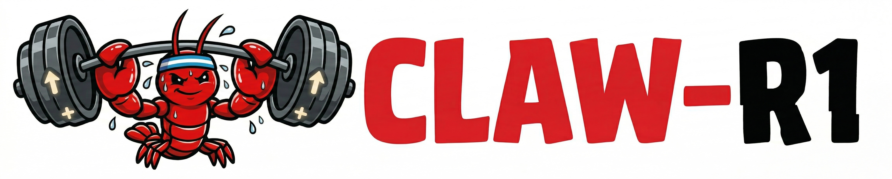
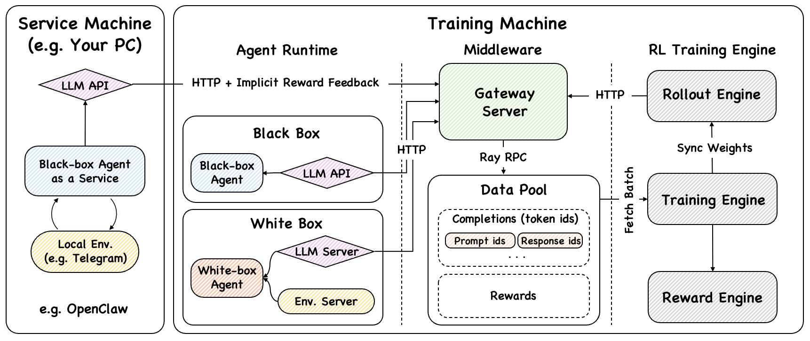

<h1 align="center"> Claw-R1: Agentic RL for Modern Agents </h1>

<p align="center">
  <a href="https://github.com/AgentR1/Claw-R1/stargazers"></a>
  <a href="https://github.com/AgentR1/Claw-R1/network/members"></a>
</p>

<p align="center"></p>

## Overview

**Agentic RL** has become the dominant approach for training powerful LLM agents. Meanwhile, **General Agents** (e.g., OpenClaw, Claude Code, Open Code, etc.) have emerged as game-changing systems that redefine what agents can do. Yet there remains critical gaps:

- **General Agent for Agentic RL**: Traditional Agentic RL frameworks typically rely on simple agents like ReAct. General agents (e.g., OpenClaw, Claude Code, Open Code) offer far richer capabilities—but existing RL pipelines were not designed for them.

- **Agentic RL for General Agent**: Modern base models have not been fully adapted to thrive inside general agent architectures. We aim to enable models to play a larger, more effective role within these next-generation agents.

**Claw-R1** is training framework that bridges this gap. It introduces a **Middleware Layer** (Gateway Server + DataPool) as the sole bridge between Agent Side and Training Side. Agents—white-box or black-box—access the framework via standard HTTP. This enables three modes: white-box offline, black-box offline, and black-box online service. No framework today adequately supports this paradigm—Claw-R1 is designed to fill that void.

<p align="center"></p>

## Key Features

- **Asynchronous Training & Rollout**: Decouples RL training from rollout in the framework, enabling scalable and efficient data collection and model updates.

- **Agent–Training Decoupling**: Supports online-service agents where execution and training run independently. Data flows from live user requests into DataPool; the Trainer continuously fetches batches for training—no dataset required.

- **Zero-Code Intrusion**: Black-box agents (LangChain, AutoGen, CrewAI, etc.) integrate with zero modification—just point `base_url` to the Gateway. The framework automatically collects interaction data and trains models.


## Get Started

- [Installation](docs/Installation.md)

## Contributors

**Team Members**: Daoyu Wang, Jie Ouyang, Shuo Yu

**Supervisors**: Qi Liu, Mingyue Cheng

**Affiliation**: State Key Laboratory of Cognitive Intelligence, University of Science and Technology of China


## Acknowledgements

Claw-R1 builds upon [Agent-R1](https://github.com/0russwest0/Agent-R1). We extend our gratitude to [MiniMax Forge](https://www.minimax.io/news/forge-scalable-agent-rl-framework-and-algorithm) for their architectural insights on the Middleware design, and to [rLLM](https://github.com/rllm-org/rllm) for their pioneering work on RL framework design for language agents. We also thank [OpenClaw](https://github.com/openclaw/openclaw) for their remarkable work on personal AI assistants—the modern agent paradigm that inspires our vision. We are grateful to the broader Agentic RL community and all contributors for their support.

## Citation

```bibtex
@misc{clawr1-2026,
  title={Claw-R1: Agentic RL for Modern Agents},
  author={Wang, Daoyu and Ouyang, Jie and Shuo Yu and Cheng, Mingyue and Liu, Qi},
  year={2025},
  howpublished={\url{https://github.com/AgentR1/Claw-R1}},
  note={GitHub repository}
}
```
