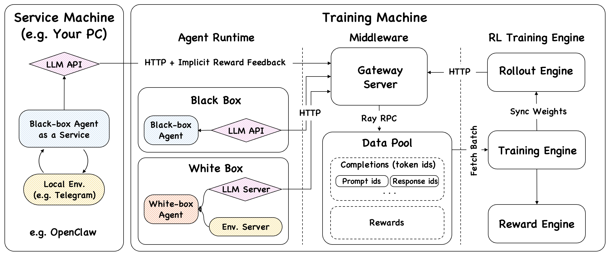

---
hide:
  - navigation
  - toc
---

# Claw-R1

<div align="center" markdown>

**Empowering OpenClaw with Advanced Agentic RL**

[](https://github.com/AgentR1/Claw-R1/stargazers)
[](https://github.com/AgentR1/Claw-R1/network/members)
[](https://github.com/AgentR1/Claw-R1/blob/main/LICENCE)
[](https://www.python.org/)

</div>

---

**Claw-R1** is an Agentic RL training framework that bridges the gap between **General Agents** (e.g., OpenClaw, Claude Code) and **Agentic Reinforcement Learning**.

It introduces a **Middleware Layer** — Gateway Server + DataPool — as the sole bridge between the Agent Side and the Training Side. Agents, whether white-box or black-box, connect to the framework via standard HTTP with **zero code modification**.

<div class="grid cards" markdown>

-   :material-connection:{ .lg .middle } **Zero-Code Integration**

    ---

    Black-box agents (LangChain, AutoGen, CrewAI, OpenClaw) integrate instantly — just redirect `base_url` to the Gateway. No SDK hooks, no source modifications.

    [:octicons-arrow-right-24: Base URL Integration](concepts/base-url-integration.md)

-   :material-layers-triple:{ .lg .middle } **Middleware Layer**

    ---

    Gateway + DataPool completely decouple the Agent Side from the Training Side, enabling asynchronous, non-blocking training while the agent keeps serving.

    [:octicons-arrow-right-24: Middleware Layer](concepts/middleware-layer.md)

-   :material-robot-industrial:{ .lg .middle } **Production Agent Scenario**

    ---

    Supports three modes: white-box offline, black-box offline, and black-box online service. In online mode, agents serve and train simultaneously — no dataset required.

    [:octicons-arrow-right-24: Production Scenario](concepts/production-scenario.md)

-   :material-lightning-bolt:{ .lg .middle } **Async Training & Rollout**

    ---

    Rollout Engine and Training Engine run independently. Data flows from live requests into DataPool; the Trainer continuously fetches batches — never blocking the agent.

    [:octicons-arrow-right-24: Async Training](components/async-training.md)

</div>

---

## Framework Overview



The framework consists of three logical layers:

| Layer | Components | Role |
|---|---|---|
| **Agent Side** | OpenClaw / White-box AgentFlow / Black-box Agent | Executes tasks, calls LLM via Gateway |
| **Middleware Layer** | Gateway Server + DataPool | Intercepts LLM calls, buffers trajectories asynchronously |
| **Training Side** | Async Trainer + Rollout Engine + Reward System | Fetches batches, updates model, syncs weights |

---

## Why Claw-R1?

Most Agentic RL frameworks share a hidden assumption: **training ≠ deployment**. They train on simulated data, deploy a fixed model, and periodically retrain. This works for research but breaks down in production:

- Models trained on synthetic tasks degrade on real user request distributions
- No mechanism for continuous adaptation to specific users or tool ecosystems
- Blocking synchronous loops make it impossible to serve while training

Claw-R1 is designed to fill this void. It enables **deployment = training**: a production agent that continuously learns from its own service interactions.

[Get started in minutes :octicons-arrow-right-24:](getting-started/installation.md){ .md-button .md-button--primary }
[Read the concepts :octicons-arrow-right-24:](concepts/index.md){ .md-button }

---

## Project Status

!!! warning "Active Development"
    Claw-R1 was initiated in March 2026 and is under active development. APIs and configurations may change before the first stable release. Contributions and feedback are welcome.

---

## Team

**Members**: Daoyu Wang, Jie Ouyang, Shuo Yu

**Supervisors**: Qi Liu, Mingyue Cheng

**Affiliation**: State Key Laboratory of Cognitive Intelligence, University of Science and Technology of China

---

## Citation

```bibtex
@misc{clawr1-2026,
  title   = {Claw-R1: Agentic RL for Modern Agents},
  author  = {Wang, Daoyu and Ouyang, Jie and Yu, Shuo and Cheng, Mingyue and Liu, Qi},
  year    = {2025},
  url     = {https://github.com/AgentR1/Claw-R1},
  note    = {GitHub repository}
}
```
